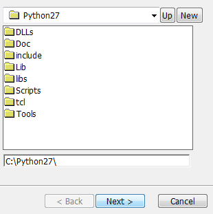
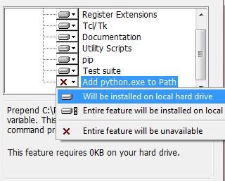
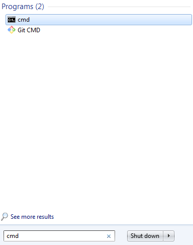
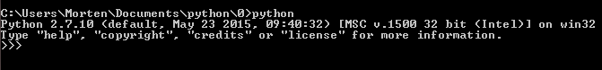

0 - Installering og `Hello World!`
----
`Python` er et programmeringsspråk, akkurat slik som `Scratch` er. Den største forskjellen er at `Scratch` er et Visuelt Programmeringsspråk, hvor vi programmerer ved å dra blokker sammen. I `Python` så må man skrive koden selv, og de *spesielle* ordene vi bruker i `Python` ligner veldig på de forskjellige blokkene vi bruker i `Scratch`.

Her vil vi se på installasjon av `Python` på tre platformer:

__[Windows]:__ For å innstallere Python så må man laste ned installeren fra nettsiden til [Python](https://python.org/). Deretter går man til `Download` og velger `Windows`.

Det er viktig at man velger riktig versjon av Python, vi skal i disse kursene bruke den eldste versjonen av python:

Legg python under mappen `C:\python27\`:

Og sørg for at `python.exe` blir lagt til i `PATH` ved å klikke på dette alternativet:

__[MacOSX & Linux]:__ Python 2.7 kommer ferdig innstallert på MacOSX og Linux.

----

### Kjør Python

For å dobbeltsjekke at `Python` har blitt riktig innstallert, så skal vi kjøre `Python` programmet, også kalt en `Python interpreter`.

__[Windows]:__ Åpne `CMD` (Command Line) ved å åpne startmenyen og skrive `cmd` og trykke enter.

Man vil deretter få opp kommandolinjen, og her skriver man `python` og trykker enter for å kjøre python. Hvis man for opp det samme som på bildet under, så er python innstallert riktig.

__[MacOSX]:__ 