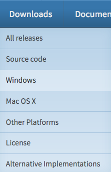
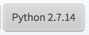

0 - Installering og `Hello World!`
----

__[Windows]:__ For å innstallere Python så må man laste ned installeren fra nettsiden til [Python](https://python.org/install). Deretter går man til `Download` og velger `Windows`.

Det er viktig at man velger riktig versjon av Python, vi skal i disse kursene bruke den eldste versjonen av python:

__[MacOSX & Linux]:__ Python 2.7 kommer ferdig innstallert på MacOSX og Linux.

